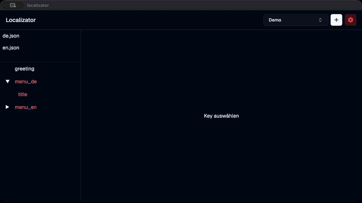

# localizator

A desktop app that helps editing localization JSON files. Currently only available in German.

## Features

- Manage projects with multiple json files
- Each json file maps to one language
- See which keys are missing a translation
- Edit translations
- Add new keys
- Save to files by click top left or [Meta + s] / [Command + s]

# Build

In order to build it you'll need the Flutter toolchain installed.
I developed and use it on MacOS, but in theory it should run on Windows & Linux as well.

# MacOS specifics

Localizator does _NOT_ use the MacOS Sandbox currently. It could be implemented though as `desktop_drop` implements passing the [bookmark information](https://pub.dev/documentation/desktop_drop/latest/desktop_drop/DropItem-class.html).
